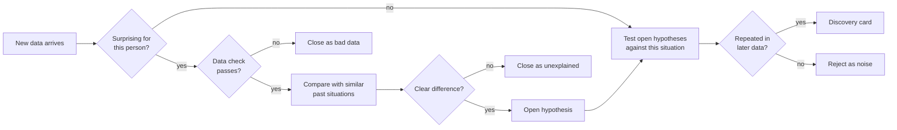
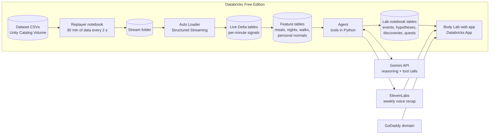
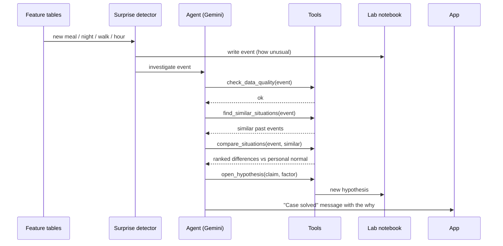
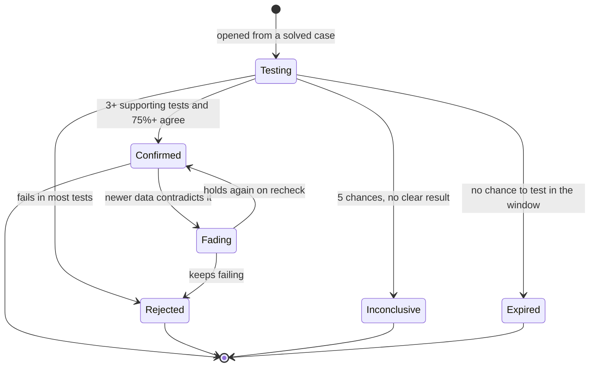

# Body Lab

**A personal scientist for your body.** When your body reacts differently to a familiar situation, Body Lab's AI agent investigates what was different, opens a hypothesis, and confirms it from your everyday life. No journaling, and no "something was unusual" alerts: you only hear from it when it has an answer.

> Health apps give you scores. Body Lab gives you a scientist.

Built at **WolfHacks (ACM at NC State)** for the **Applied AI Software (Databricks)** track.

- **Mockup:** [Body Lab mockup](https://claude.ai/artifact/7PqmPr3Fmg89AdvNkDaDiV)
- **Status:** hackathon prototype. Not a medical device and not medical advice.

---

## Table of contents

- [The problem](#the-problem)
- [What makes it different](#what-makes-it-different)
- [How it works](#how-it-works)
- [The four labs](#the-four-labs)
- [Data](#data)
- [System design](#system-design)
- [Agent design](#agent-design)
- [Gamification](#gamification)
- [Tech stack](#tech-stack)
- [Repository structure](#repository-structure)
- [Getting started](#getting-started)
- [Limitations](#limitations)
- [Hackathon plan](#hackathon-plan)
- [Team](#team)
- [Acknowledgements and license](#acknowledgements-and-license)

---

## The problem

Millions of people can now see their glucose curves, but no app tells them **why** one meal spiked and a similar meal did not.

- About 1 in 3 US adults has prediabetes, and most do not know it (CDC, approximate). Lifestyle changes can prevent or delay type 2 diabetes.
- Over-the-counter glucose monitors launched in 2024 (Dexcom Stelo, Abbott Lingo), so raw curves are now in consumers' hands.
- Existing apps give scores and averages, send "higher than usual" alerts, or need daily manual journaling.

## What makes it different

| Body Lab does | Typical apps do |
| --- | --- |
| Notifies only when it has an answer: a solved case or a confirmed discovery | Alert that something was unusual (for example Fitbit Body Responses, high heart rate alerts) |
| Investigates one surprising event against similar past situations | Compare with a general average |
| Treats findings as hypotheses and confirms them with natural experiments | Present insights as facts, never tested |
| Detects behavior from sensors, no journaling | Ask for daily check-ins or mood logs |
| Says "unexplained" when nothing stands out | Always produce an explanation, or none at all |
| Links findings across glucose, stress, sleep and movement | Keep each metric in its own silo |

**Example:**

| Fitbit-style alert | Body Lab message |
| --- | --- |
| "Your heart rate was higher than usual during your walk." | "Your walk heart rate was 15 bpm above your usual for this walk. The biggest difference: you slept 5h 10m vs your usual 7h. Second time seen; 1 more to confirm." |
| (no follow-up) | "Confirmed: after short nights, your walks run 12 bpm higher. Held in 4 of 5 tests." |

---

## How it works



1. **Spot a surprise quietly.** A response far outside the person's normal range for a similar situation, for example the same pasta lunch: +25 mg/dL on Tuesday, +70 on Thursday. No alert is sent.
2. **Check the data first.** Sensor gaps, sensor warm-up, a missing snack or a wrong meal time. Bad data is dismissed.
3. **Compare.** Rank what was different against the person's own day-to-day variation (steps before eating, time of day, stress, starting glucose).
4. **Open a hypothesis.** The top difference becomes a lead, not a finding.
5. **Wait for natural experiments.** Every later situation where the factor is present or absent counts as a test. No deliberate experiments needed.
6. **Confirm or reject.** Repeated support makes a discovery card; otherwise it is logged as noise.

**Messages: answers, not alerts.** The user hears from Body Lab only with an answer. Every message leads with the why and shows progress ("1 of 3 tests needed to confirm"). Surprises with no clear reason close quietly and appear only as a weekly count.

---

## The four labs

All four labs run on the same person's wristband data. Glucose and meals are core inputs only for the Fuel Lab.

| Lab | Compares | Example surprise | Example discovery |
| --- | --- | --- | --- |
| Fuel | Meal vs similar meal (similar carbs and time of day) | Same pasta: +25 vs +70 | Walking before lunch shrinks your spike |
| Stress | Hour vs the same hour on similar days | Tuesday 3pm far above your usual 3pm | Your stress signal peaks on weekday afternoons |
| Sleep (estimated) | Night vs other nights | Fell asleep 1 hour later than usual | Evening walks bring your sleep earlier |
| Movement and Rhythm | Walk vs similar walk; day vs similar day | Same 30-minute walk, heart rate 15 bpm higher | After short nights, your walks run 12 bpm higher |

### Inputs per lab

- **Measures:** what the lab watches for surprises
- **Cause:** a possible explanation the agent tests
- **Control:** used only to make comparisons fair, never a finding

| Data source | Fuel | Stress | Sleep | Movement and Rhythm |
| --- | --- | --- | --- | --- |
| Glucose (Dexcom G6) | **Measures** spike after eating | Not used | Cause: evening glucose | Not used |
| Food log | **Defines the meal** (time, carbs) | Control: after-meal hours compared with after-meal hours | Cause: dinner time (limited) | Cause: time since last meal (limited) |
| Accelerometer | Cause: steps before and after eating | Control: only still periods count; Cause: activity earlier | **Measures** sleep from night stillness; Cause: evening activity | **Measures** walks and daily activity timing |
| Heart rate and HRV | Cause: stress before eating | **Measures** stress signal | **Measures** overnight heart rate | **Measures** heart rate during and after walks |
| EDA | Cause: stress before eating | **Measures** stress signal | Cause: daytime stress | Cause: stress earlier that day |
| Skin temperature | Not used | Control: band-off check | Cause: warm nights | **Measures** daily temperature rhythm |

One lab's result can be another's cause: last night's estimated sleep can explain a stress spike or a high-heart-rate walk the next day.

### How each lab's signal is calculated

| Lab | Calculation |
| --- | --- |
| Fuel | Glucose rise (peak minus starting value) in the 2 hours after a logged meal |
| Stress | EDA peaks plus heart rate above the person's resting level, counted only while the person is still, so exercise is not mistaken for stress |
| Sleep | Longest stretch of near-zero movement at night gives estimated sleep start, end and length; movement bursts within it give restlessness; the overnight heart rate dip gives recovery |
| Movement and Rhythm | Walks = 10+ minutes of steady movement; measured by average heart rate during the walk and time to return to resting heart rate. Daily rhythm = when activity starts and ends and when heart rate and temperature peak |

EDA measures arousal, not only stress, so the app calls it a "stress signal." Sleep is estimated from movement and heart rate, without sleep stages.

---

## Data

We use the [BIG IDEAs Lab Glycemic Variability and Wearable Device Dataset](https://physionet.org/content/big-ideas-glycemic-wearable/1.1.3/) from PhysioNet, because all four labs can then run on the same person.

| Item | Detail |
| --- | --- |
| People | 16 adults, aged 35 to 65, HbA1c 5.2 to 6.4% (high-normal to prediabetic) |
| Duration | 8 to 10 days each |
| Glucose | Dexcom G6, every 5 minutes |
| Wristband | Empatica E4: accelerometer 32 Hz, PPG 64 Hz (heart rate, interbeat interval), EDA 4 Hz, skin temperature 4 Hz |
| Food log | Date, time, food, amount, unit, calories, carbs, fiber, sugar, protein, fat |
| Other | `Demographics.csv` with HbA1c |
| Files | One folder per participant, one CSV per signal |
| License | Open Data Commons Attribution License v1.0 |

**Why not IMU50:** the [IMU50 dataset](https://zenodo.org/records/21468410) has different people, no glucose or food logs, no activity labels, and a single 46.7 GB zip. It is a candidate for future validation of the Sleep and Movement labs.

---

## System design

### Architecture



The replayer stands in for a phone app uploading wristband and glucose data. Everything after it is what a production system would run.

### Streaming replay

The dataset is recorded, so we replay it as if it were arriving live, sped up so a day plays in about 5 minutes.

1. The **replayer** reads each participant's CSVs in time order and writes small chunks into a Volume folder.
2. **Auto Loader** picks up each new file and appends it to live Delta tables.
3. High-frequency wristband signals are downsampled to **per-minute** values (steps, mean heart rate, mean EDA, mean temperature) before replay.
4. Feature jobs update `meal_features`, night and walk features, and `personal_normal`.

On Databricks Free Edition (serverless), streaming may be limited to `availableNow` triggers. If so, the trigger runs in a short loop, which looks the same in the demo.

### Investigation sequence



### Hypothesis lifecycle



---

## Agent design

The agent's memory lives in Delta tables (its **lab notebook**), not in the language model. Gemini only sees a short summary of the relevant rows when it handles a new event. The agent chooses which tools to call and in what order: if a data check fails it stops, and if nothing stands out it closes the case as unexplained.

### Tools

| Tool | Input | Returns |
| --- | --- | --- |
| `check_data_quality` | event id | Sensor gaps, warm-up period, missing or suspect meal logs |
| `find_similar_situations` | event id, lab | Past events with similar carbs, time slot or activity |
| `compare_situations` | event id, list of similar ids | Each signal's difference, scored against personal variation |
| `get_personal_normal` | user, signal, context | Typical range (median and spread) for that person |
| `open_hypothesis` | claim, factor, lab | New row in `hypotheses` |
| `record_evidence` | hypothesis id, event id, supports or contradicts | Updated counts and status |
| `propose_quest` | discovery id | One optional quest the sensors can detect |

### Lab notebook tables

| Table | Key columns |
| --- | --- |
| `events` | event_id, user, time, lab, signal, size of response, how unusual (percentile), verdict (bad data, unexplained, lead), hypothesis_id |
| `hypotheses` | hyp_id, user, lab, claim, factor, supports, contradicts, chances_seen, status, opened_at, last_tested_at |
| `discoveries` | card_id, user, lab, claim, effect size, evidence (for example 4 of 5), rarity, confirmed_at, last_checked_at, fading flag |
| `quests` | quest_id, user, discovery_id, target, progress, week |

### Hypothesis rules

Example values, shortened for the 8 to 10 day dataset.

| Outcome | Rule |
| --- | --- |
| Investigate | Event in the top 10% of unusual for that person and context |
| Confirmed | At least 3 supporting tests and at least 75% of tests agree |
| Rejected | Fails in most tests, logged as noise |
| Inconclusive | 5 chances without a clear result |
| Expired | No chance to test within the window (4 days in the demo, about 30 days in production) |
| Open slots | At most 10 open hypotheses per person, at most 2 of them about meals; the weakest is dropped first |
| Fading | A confirmed card contradicted by newer data is marked fading and rechecked |

Every situation tests open hypotheses, not just surprising ones, so results are not biased toward confirmation. One event never becomes a finding.

### Data check rules

Starting values, to be tuned on the real data. If any check fails, the case closes as bad data before any comparison.

| Check | Rule | Why |
| --- | --- | --- |
| Glucose gaps | More than 15 minutes missing in the 2 hours after a meal | The peak may be missing |
| Sensor warm-up | Readings in the first 24 hours of a new sensor | New sensors read less accurately |
| Impossible jumps | Glucose changes more than about 15 to 20 mg/dL in 5 minutes | Sensor noise, not physiology |
| False lows | Sharp drop at night with a quick rebound | Lying on the sensor |
| Wristband off | Skin temperature well below normal, or EDA near zero | Band not on the wrist |
| Overlapping meals | Another meal or snack within 2 hours | Two curves blur into one |
| Wrong meal time | Glucose rises 15+ minutes before the logged time | Log time probably wrong |
| Unlogged meal | Big rise with no meal logged nearby | Food log incomplete |

### Normal range

- **Default:** a simple per-person model of expected glucose rise from carbs and time of day, fit on all of that person's meals. A surprise is a rise far from expected compared with how far off the model usually is (top or bottom 10%).
- **With 4 or more truly similar meals** (carbs within about ±20 g, same time slot): use their rises directly; outside the middle 80% is a surprise.
- **Other signals** (steps, heart rate, EDA, temperature): the person's typical value at that hour of day, on weekdays or weekends.

### Keeping meals from dominating findings

1. **Match on meals.** Fuel compares meals with similar carbs, so "you ate more" is never the answer. Stress compares after-meal hours only with after-meal hours. Sleep compares nights with similar dinner timing when testing other causes.
2. **Known effects are baseline, not findings.** Carbs raise glucose, digestion raises heart rate, exercise raises heart rate and EDA. Only what is left over can become a discovery: "an evening walk raises heart rate" is never a card, but "after evening walks, your overnight heart rate is lower" can be.
3. **Separate candidate causes per lab,** with at most 2 meal-related open hypotheses.
4. **Obvious findings are common cards** worth little toward rank. Rare and legendary cards go to patterns unusual for that person.

### Wording rule

The agent says "this was different," never "this caused." It gives no medical advice.

---

## Gamification

Everything is detected from sensors, so playing takes no extra effort.

| Feature | How it works | User effort |
| --- | --- | --- |
| Discovery cards | Each confirmed pattern becomes a card. Rarity: common, rare, legendary | None |
| Scientist rank | Intern, Lab Tech, Researcher, Professor. Rises with discoveries, never drops | None |
| Weekly quests | 1 to 3 optional quests from your own findings, completion detected by sensors | Optional |
| Weekly voice recap | 30-second summary read by ElevenLabs | Tap play |
| Discovery funnel | Shows how many surprises were dismissed as noise | None |

No competitive leaderboard: ranking people on health can backfire.

**Meal logging:** the demo uses the dataset's food logs. A side feature shows photo logging: Gemini takes a meal photo and returns foods, portion, carbs, protein, fat, fiber, calories and a confidence level as JSON, and the user confirms with one tap. Photo carbs are treated as rough, so similar-meal ranges are wider for them.

### Screens

| Screen | What it shows |
| --- | --- |
| Today | Confirmed discovery and solved case cards (each leading with the why), count of surprises closed quietly, scientist rank, weekly quest, the four labs, voice recap |
| Case | Two curves on one chart, data check, ranked differences against the normal band, verdict |
| Discoveries | Cards with rarity (legendary, rare, common, fading) and locked cards close to confirmation |
| Notebook | Open hypotheses with evidence, the discovery funnel, recently rejected hypotheses |

---

## Tech stack

| Layer | Technology | Role |
| --- | --- | --- |
| Storage | Unity Catalog Volume + Delta tables | Raw CSVs, live tables, features, lab notebook |
| Streaming | Replayer notebook + Auto Loader (Structured Streaming) | Replays a week in a few minutes |
| Features | Spark SQL and pandas | Per-minute signals, meal, night and walk features, personal normals |
| Agent | Gemini API function calling + Python tools | Investigation loop, explanations, weekly summary, meal photo parsing |
| Tracing (optional) | MLflow tracing | Logs each agent run so tool calls can be inspected |
| Web app | Databricks App (Streamlit + Plotly) | Today, Case, Discoveries, Notebook |
| Voice | ElevenLabs text-to-speech | 30-second weekly recap |
| Domain | GoDaddy Registry | Public URL |
| Dev | GitHub + Copilot | Repo and faster coding |

Not used: Solana (health data on a public chain is a privacy problem) and Tiger Data (duplicates Delta tables). If the team prefers React, the web app can be React with a FastAPI backend hosted as a Databricks App.

---

## Repository structure

Proposed layout:

```text
body-lab/
├── README.md
├── data/
│   └── README.md              # how to download the dataset (data itself not committed)
├── notebooks/
│   ├── 01_load_raw.py         # CSVs -> Volume -> raw Delta tables
│   ├── 02_downsample.py       # wristband signals -> per-minute
│   ├── 03_replayer.py         # writes timed chunks into the stream folder
│   ├── 04_stream_ingest.py    # Auto Loader -> live Delta tables
│   ├── 05_features.py         # meal, night, walk, hourly stress features + personal normals
│   └── 06_run_agent.py        # surprise detector + agent loop over new events
├── agent/
│   ├── tools.py               # the seven tools over Delta tables
│   ├── rules.py               # data checks, hypothesis lifecycle, rarity
│   ├── prompts.py             # system prompt and message templates
│   └── loop.py                # Gemini function-calling loop
├── app/
│   ├── app.py                 # Streamlit entry point
│   ├── app.yaml               # Databricks App config
│   ├── pages/                 # Today, Case, Discoveries, Notebook
│   └── voice.py               # ElevenLabs recap
└── tests/
    └── test_planted.py        # planted-change validation
```

---

## Getting started

### Prerequisites

- A Databricks Free Edition workspace with serverless notebooks and Databricks Apps
- A Gemini API key from Google AI Studio
- An ElevenLabs API key
- The BIG IDEAs dataset downloaded from PhysioNet

### Setup

1. **Upload the data.** Create a Unity Catalog Volume (for example `/Volumes/main/body_lab/raw`) and upload the participant folders.
2. **Store secrets.** Add the API keys as Databricks secrets:

   ```bash
   databricks secrets create-scope body-lab
   ```

   ```bash
   databricks secrets put-secret body-lab gemini_api_key
   ```

   ```bash
   databricks secrets put-secret body-lab elevenlabs_api_key
   ```

3. **Build the tables.** Run notebooks `01` to `02` once.
4. **Start the replay.** Run `04_stream_ingest.py`, then `03_replayer.py`. Run `05_features.py` and `06_run_agent.py` on a short loop.
5. **Deploy the app.** Create a Databricks App from the `app/` folder (UI or CLI), give it access to the `body_lab` schema and the secret scope, then open its URL.

Paths, schema names and commands above are the planned defaults; adjust them to your workspace.

---

## Limitations

- **Small dataset:** 16 people over 8 to 10 days, so confirmation thresholds are shortened for the demo.
- **Replayed, not live:** data is replayed through Databricks streaming. A phone app would feed the same pipeline live.
- **Self-reported food logs:** times and portions can be wrong, so the agent checks logs before blaming the body.
- **Unmeasured factors:** sleep quality, illness, medication and meal order are not fully captured; the agent reports differences, not causes.
- **Estimated signals:** sleep comes from movement and heart rate; EDA reflects arousal, not only stress.
- **Not medical advice.**

---

<details>
<summary><strong>Demo script (3 minutes)</strong></summary>

1. **Hook (0:00 to 0:20):** "1 in 3 US adults has prediabetes. Glucose monitors are now sold over the counter, but they show curves, not reasons."
2. **Start the replay (0:20 to 0:40):** Databricks streams one participant's week at high speed.
3. **The case (0:40 to 1:30):** no alert fires; a solved case appears: "Thursday's lunch spiked because you barely moved before eating." Open it: same pasta, +25 vs +70, data check passes, ranked differences, hypothesis opened.
4. **Confirmation (1:30 to 2:00):** later meals add evidence; the hypothesis becomes a discovery card and the rank rises.
5. **Rigor (2:00 to 2:30):** the Notebook funnel shows most surprises dismissed; the agent finds a planted change.
6. **Close (2:30 to 3:00):** the ElevenLabs recap plays. "Health apps give you scores. Body Lab gives you a scientist."

Backup: a recorded 2-minute video.

</details>

<details>
<summary><strong>Risks and prepared answers</strong></summary>

| Risk | Fallback |
| --- | --- |
| Few similar meal pairs per person | Use the per-person expected-rise model; pick the participant with the most meals |
| No overnight wristband data | Drop the Sleep Lab |
| Serverless streaming only runs `availableNow` | Run that trigger in a loop |
| Gemini tool calling flaky | Fixed tool order, Gemini writes only the explanation |
| Databricks App deploy issues | Run Streamlit locally against Databricks SQL |
| Running out of time | Follow the cut list |

| Question | Answer |
| --- | --- |
| Isn't this just Fitbit-style notifications? | Fitbit tells you something unusual happened. Body Lab tells you why, checks itself over the next week, and only then calls it a finding. |
| Isn't one surprising event just an outlier? | Maybe, so one event never becomes a finding. Data is checked first and the pattern must repeat. |
| Won't meals explain everything? | Situations are matched on meals and known effects are baseline, so the agent finds what else changed. |
| How do you know the explanations are right? | Planted tests, and it rediscovers known effects such as walking lowering spikes. |
| Doesn't Levels or WHOOP already do this? | They give scores or need journaling. Body Lab investigates single events and confirms findings automatically. |
| Why is this agentic and not a script? | The agent chooses tools, stops on bad data, and can close a case as unexplained. |
| Is the data really streaming? | It is replayed through Databricks streaming; a phone app would feed the same pipeline live. |
| Is this medical advice? | No. It reports what was different, never causes or treatment. |

</details>

---

## Team

| Role | Owns | Name |
| --- | --- | --- |
| Data | Upload, replayer, streaming tables, features | |
| Agent | Surprise detector, tools, Gemini loop, hypothesis rules | |
| App | Databricks App, screens, charts | |
| Pitch | Domain, voice recap, slides, video, Devpost | |

---

## Acknowledgements and license

- **Data:** BIG IDEAs Lab Glycemic Variability and Wearable Device Dataset, via [PhysioNet](https://physionet.org/content/big-ideas-glycemic-wearable/1.1.3/), under the Open Data Commons Attribution License v1.0. Please cite the dataset and PhysioNet as described on the dataset page. The data is not included in this repository.
- **Event:** WolfHacks by ACM at NC State, with Major League Hacking.
- **Code license:** to be decided by the team (for example MIT).
